# Events Flow Diagram

```mermaid
flowchart LR
    %% Event Emitters
    FifoStack["FifoStack"]
    InitService["InitService"]
    EventService["EventService"]
    OutputController["OutputController"]
    KeyboardController["KeyboardController"]
    InputController["InputController"]
    DialogController["DialogController"]
    CommandController["CommandController"]
    AppController["AppController"]
    BoxOutputController["BoxOutputController"]

    %% Event Handlers
    AppControllerHandler["AppController"]
    InputControllerHandler["InputController"]
    DialogControllerHandler["DialogController"]
    CommandControllerHandler["CommandController"]
    TextInput["TextInput"]
    ScrollOutput["ScrollOutput"]
    Prompter["Prompter"]
    Output["Output"]
    OutputView["OutputView"]
    BoxOutput["BoxOutput"]
    App["App"]
    EditCommand["EditCommand"]
    ConfigCommand["ConfigCommand"]

    %% Events
    TaskRunErrorEvent["TaskRunErrorEvent"]
    AppInitializedEvent["AppInitializedEvent"]
    SetStatusMessageEvent["SetStatusMessageEvent"]
    OutputUpdatedEvent["OutputUpdatedEvent"]
    OutputRowsCountUpdatedEvent["OutputRowsCountUpdatedEvent"]
    UIFreezeStatedChangedEvent["UIFreezeStatedChangedEvent"]
    RunCommandEvent["RunCommandEvent"]
    CommandClearInputEvent["CommandClearInputEvent"]
    InputToStartEvent["InputToStartEvent"]
    InputToEndEvent["InputToEndEvent"]
    CommandSetInputEvent["CommandSetInputEvent"]
    HideInitBoxOutputEvent["HideInitBoxOutputEvent"]
    HelpOutputUpdatedEvent["HelpOutputUpdatedEvent"]
    SpeakCommandEvent["SpeakCommandEvent"]
    LogErrorEvent["LogErrorEvent"]
    CommandParseErrorEvent["CommandParseErrorEvent"]
    CommandNotFoundEvent["CommandNotFoundEvent"]
    CommandFileNotFoundEvent["CommandFileNotFoundEvent"]
    CommandPluginLoadErrorEvent["CommandPluginLoadErrorEvent"]
    CommandArgsCountErrorEvent["CommandArgsCountErrorEvent"]
    CommandRunErrorEvent["CommandRunErrorEvent"]
    InputSubmitedEvent["InputSubmitedEvent"]
    CommandInputStartedEvent["CommandInputStartedEvent"]
    InputAddedEvent["InputAddedEvent"]
    GaugeSourceUpdatedEvent["GaugeSourceUpdatedEvent"]
    InputExecutedEvent["InputExecutedEvent"]
    AppStartedEvent["AppStartedEvent"]
    LayoutResizedEvent["LayoutResizedEvent"]
    ConsoleClearedEvent["ConsoleClearedEvent"]
    BoxOutputUpdatedEvent["BoxOutputUpdatedEvent"]
    PromptVisibilityLostEvent["PromptVisibilityLostEvent"]
    LogWarningEvent["LogWarningEvent"]

    %% Emitter to Event connections with properties
    FifoStack -->|"errorEvent, task"| TaskRunErrorEvent
    InitService -->|"(no data)"| AppInitializedEvent
    InitService -->|"StatusMessage(from, status, text)"| SetStatusMessageEvent
    EventService -->|"(args)"| OutputUpdatedEvent
    EventService -->|"(args)"| OutputRowsCountUpdatedEvent
    OutputController -->|"(no data)"| OutputUpdatedEvent
    OutputController -->|"(no data)"| OutputRowsCountUpdatedEvent
    KeyboardController -->|"boolean: freezeState"| UIFreezeStatedChangedEvent
    KeyboardController -->|"command: string"| RunCommandEvent
    KeyboardController -->|"(no data)"| CommandClearInputEvent
    KeyboardController -->|"(no data)"| InputToStartEvent
    KeyboardController -->|"(no data)"| InputToEndEvent
    InputController -->|"command: string"| CommandSetInputEvent
    InputController -->|"(no data)"| HideInitBoxOutputEvent
    InputController -->|"(no data)"| HelpOutputUpdatedEvent
    DialogController -->|"StatusMessage"| SetStatusMessageEvent
    DialogController -->|"StatusMessage"| SetStatusMessageEvent
    DialogController -->|"(no data)"| SetStatusMessageEvent
    DialogController -->|"(no data)"| SpeakCommandEvent
    DialogController -->|"errorEvent"| LogErrorEvent
    CommandController -->|"errorEvent, args"| CommandParseErrorEvent
    CommandController -->|"errorEvent, args, cmd"| CommandNotFoundEvent
    CommandController -->|"errorEvent, args, cmd, path"| CommandFileNotFoundEvent
    CommandController -->|"errorEvent, cmd, cn"| CommandPluginLoadErrorEvent
    CommandController -->|"commandDef or errorEvent, args"| CommandArgsCountErrorEvent
    CommandController -->|"errorEvent, cmd, cn"| CommandRunErrorEvent
    AppController -->|"speakEvent"| SpeakCommandEvent
    AppController -->|"boolean: freezeState"| UIFreezeStatedChangedEvent
    AppController -->|"sourceKey"| GaugeSourceUpdatedEvent
    BoxOutputController -->|"(no data)"| BoxOutputUpdatedEvent

    %% Event to Handler connections with properties
    TaskRunErrorEvent -->|"errorData"| AppControllerHandler
    AppInitializedEvent -->|"(no data)"| AppControllerHandler
    SetStatusMessageEvent -->|"StatusMessage"| AppControllerHandler
    OutputUpdatedEvent -->|"(no data)"| ScrollOutput
    OutputUpdatedEvent -->|"(no data)"| Output
    OutputRowsCountUpdatedEvent -->|"(no data)"| AppControllerHandler
    UIFreezeStatedChangedEvent -->|"boolean"| AppControllerHandler
    RunCommandEvent -->|"command: string"| CommandControllerHandler
    CommandClearInputEvent -->|"(no data)"| Prompter
    InputToStartEvent -->|"(no data)"| TextInput
    InputToEndEvent -->|"(no data)"| TextInput
    CommandSetInputEvent -->|"command: string"| Prompter
    HideInitBoxOutputEvent -->|"(no data)"| App
    HelpOutputUpdatedEvent -->|"(no data)"| AppControllerHandler
    HelpOutputUpdatedEvent -->|"(no data)"| ScrollOutput
    SpeakCommandEvent -->|"speakData"| DialogControllerHandler
    LogErrorEvent -->|"errorData"| AppControllerHandler
    CommandParseErrorEvent -->|"errorData"| AppControllerHandler
    CommandNotFoundEvent -->|"errorData"| AppControllerHandler
    CommandFileNotFoundEvent -->|"errorData"| AppControllerHandler
    CommandPluginLoadErrorEvent -->|"errorData"| AppControllerHandler
    CommandArgsCountErrorEvent -->|"errorData"| AppControllerHandler
    CommandRunErrorEvent -->|"errorData"| AppControllerHandler
    InputSubmitedEvent -->|"input: string"| AppControllerHandler
    CommandInputStartedEvent -->|"(no data)"| InputControllerHandler
    InputAddedEvent -->|"input: string"| InputControllerHandler
    GaugeSourceUpdatedEvent -->|"sourceKey"| AppControllerHandler
    InputExecutedEvent -->|"(no data)"| AppControllerHandler
    AppStartedEvent -->|"(no data)"| App
    LayoutResizedEvent -->|"(no data)"| ScrollOutput
    LayoutResizedEvent -->|"(no data)"| Output
    LayoutResizedEvent -->|"(no data)"| BoxOutput
    ConsoleClearedEvent -->|"(no data)"| ScrollOutput
    BoxOutputUpdatedEvent -->|"(no data)"| BoxOutput
    PromptVisibilityLostEvent -->|"(no data)"| App
    LogWarningEvent -->|"warningData"| AppControllerHandler

    %% Styling
    classDef emitter fill:#e1f5fe,stroke:#01579b,stroke-width:2px,color:#000
    classDef handler fill:#f3e5f5,stroke:#4a148c,stroke-width:2px,color:#000
    classDef event fill:#fff3e0,stroke:#e65100,stroke-width:2px,color:#000

    class FifoStack,InitService,EventService,OutputController,KeyboardController,InputController,DialogController,CommandController,AppController,BoxOutputController emitter
    class AppControllerHandler,InputControllerHandler,DialogControllerHandler,CommandControllerHandler,TextInput,ScrollOutput,Prompter,Output,OutputView,BoxOutput,App,EditCommand,ConfigCommand handler
    class TaskRunErrorEvent,AppInitializedEvent,SetStatusMessageEvent,OutputUpdatedEvent,OutputRowsCountUpdatedEvent,UIFreezeStatedChangedEvent,RunCommandEvent,CommandClearInputEvent,InputToStartEvent,InputToEndEvent,CommandSetInputEvent,HideInitBoxOutputEvent,HelpOutputUpdatedEvent,SpeakCommandEvent,LogErrorEvent,CommandParseErrorEvent,CommandNotFoundEvent,CommandFileNotFoundEvent,CommandPluginLoadErrorEvent,CommandArgsCountErrorEvent,CommandRunErrorEvent,InputSubmitedEvent,CommandInputStartedEvent,InputAddedEvent,GaugeSourceUpdatedEvent,InputExecutedEvent,AppStartedEvent,LayoutResizedEvent,ConsoleClearedEvent,BoxOutputUpdatedEvent,PromptVisibilityLostEvent,LogWarningEvent event
```

## Event Summary

### Major Event Emitters:
- **CommandController**: Emits command-related error events (parse errors, not found, file not found, plugin load errors, run errors, args count errors)
- **DialogController**: Emits status message, log error, and speak command events
- **AppController**: Central emitter for app lifecycle, UI state, and input execution events
- **InputController**: Emits input-related events (command set input, hide init box, help output)
- **KeyboardController**: Emits keyboard-triggered events (UI freeze, run command, clear input, input navigation)
- **EventService**: Generic event emitter service

### Major Event Handlers:
- **AppController**: Handles most system events including input submission, command errors, app lifecycle, and UI state changes
- **App Component**: Handles UI-related events (init box, app start, layout resize, help output, prompt visibility, status messages)
- **Prompter Component**: Handles input-related events (input executing, clear input, set input)

### Key Event Categories:
1. **Command Events**: Parse, execution, and error handling
2. **UI Events**: Layout, status, visibility, and freeze states
3. **Input Events**: Submission, execution, clearing, and navigation
4. **App Lifecycle**: Initialization, startup, and shutdown
5. **Error Events**: Logging and error handling
6. **Communication Events**: Speech and status updates

This event-driven architecture allows for loose coupling between components while maintaining a clear flow of information throughout the application.
